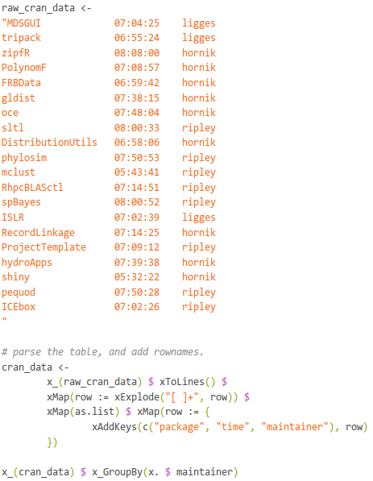

RHighlight
================

RHighlight is a client-side syntax highlighter for R code.

Unlike most syntax highlighters, comments, strings and parentheses are emphasised and
other elements are played down. The assumption is that most programmers are competent
enought to spot numbers and boolean values, so colouring is best spent
outlining the structure and documentation of a program.

*note: I wrote RHighlight when I was inexperienced at writing Javascript.*

### 1 Requirements


### 2 Installation

It is trivial to add RHighlight to your website. I'm assuming your site has a /js and /css
subdirectory, and an index page just be below root. (if not, just adapt these instuctions
to your needs).

Add the files from this repository as such:

```
mySite [

	js [
		rhighlight.js
		rhighlight-min.js
	]

	css [
		rhighlight-mint [
			mint-light.sass
			mint-dark.sass

			mint-light.css
			mint-dark.css
		]
	]

	yourIndex.html
]
```
Now we can work on loading this content into your page. Here is an example
document head

```html
<!DOCTYPE html>
<html>
<head>
	<title>My Page</title>

	<script src="js/rhighlight.js" type="text/javascript"></script>

</head>
```html

Then add your normal document-body, including your code tags. You should use
a specific class for the R code you wish to highlight.

```html
<body>
A shameless self-plug of my library "Arrow".

<pre class = "myRCodeClass">
# this is a code example
"this is a string containing a 'second string!'"

GDP <- list(
	list('Saudi Arabia', 711050 * 10^6),
	list('Switzerland', 631050 * 10^6),
	list('Netherlands', 770067 * 10^6),
	list('Iran', 551588 * 10^6)
)

x_(GDP) $ x_MaxBy(xSecondOf)

# list("Netherlands", 7.70067e+11)
</pre>

Available in fine git repositories nationwide.

</body>
```
After the body of your document you need to call the highlighter code. Generally you
will use `.highlight_r_code` to highlight all the elements on a page matching a jQuery
selector.

You can use a selector of your choice, but a simple method is to use a class select
like ".myRCodeClass". The callback function takes the highlighted code as a string,
and lets you wrap the code in html of your choice.  You will probably want to use the
same tag your R code was initially wrapped in.

```html
<script type="text/javascript">

rhighlight.highlight_r_code(".myRCodeClass", function (text) {
	return "<pre class = 'myRCodeClass'>" + text + "<pre>"
})

</script>
</html>
```

And that's it! Your page should now have nice syntax highlighting.

### Examples



### License

The MIT License

Copyright (c) 2014 Ryan Grannell

Permission is hereby granted, free of charge, to any person obtaining a copy of this software and associated documentation files (the "Software"), to deal in the Software without restriction, including without limitation the rights to use, copy, modify, merge, publish, distribute, sublicense, and/or sell copies of the Software, and to permit persons to whom the Software is furnished to do so, subject to the following conditions:

The above copyright notice and this permission notice shall be included in all copies or substantial portions of the Software.

THE SOFTWARE IS PROVIDED "AS IS", WITHOUT WARRANTY OF ANY KIND, EXPRESS OR IMPLIED, INCLUDING BUT NOT LIMITED TO THE WARRANTIES OF MERCHANTABILITY, FITNESS FOR A PARTICULAR PURPOSE AND NONINFRINGEMENT. IN NO EVENT SHALL THE AUTHORS OR COPYRIGHT HOLDERS BE LIABLE FOR ANY CLAIM, DAMAGES OR OTHER LIABILITY, WHETHER IN AN ACTION OF CONTRACT, TORT OR OTHERWISE, ARISING FROM, OUT OF OR IN CONNECTION WITH THE SOFTWARE OR THE USE OR OTHER DEALINGS IN THE SOFTWARE.
